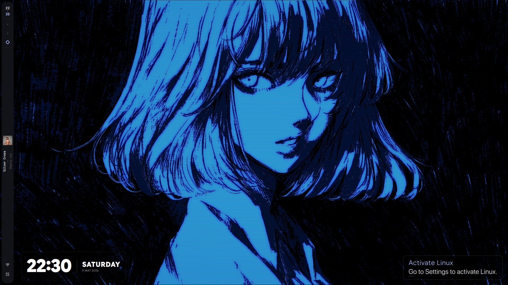
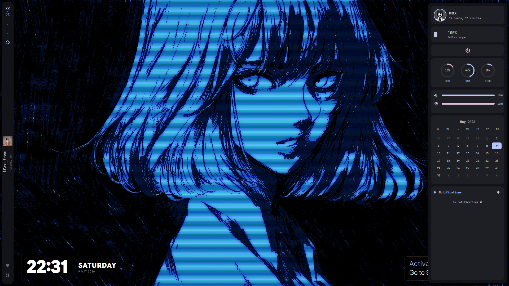
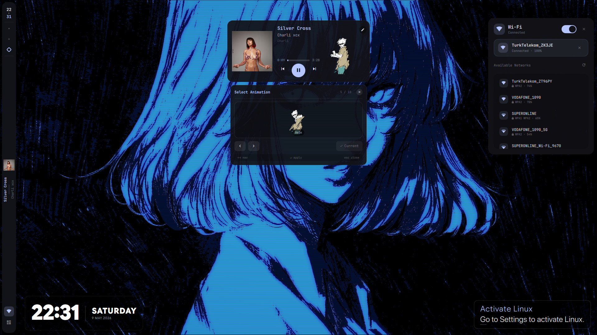

# vroomies 🚀

> *"See you space cowboy..."* — Cowboy Bebop

hyprland + quickshell. no waybar. no bloat.

A collection of power-user setup scripts for Arch, Fedora, Void Linux, and NixOS — built around Hyprland, Quickshell, and a clean anime-coded terminal life.

---

## Scripts

| Script | Distro | Package Manager |
|--------|--------|-----------------|
| `AETHER.sh` | Arch Linux / Arch-based | `yay` / `paru` / `trizen` |
| `IGNITE.sh` | Fedora | `dnf` |
| `PHANTOM.sh` | Void Linux | `xbps` |
| `EDEN.sh` | NixOS | `nix` + `home-manager` + flakes |

AETHER, IGNITE and PHANTOM install the same core stack — only the package manager changes. EDEN is fully declarative via NixOS flakes + Home Manager.

---

## What Gets Installed

- **WM:** Hyprland
- **Shell:** Fish + Starship + Zoxide
- **Bar / UI:** Quickshell
- **Wallpaper:** awww (swww) 
- **Terminal:** Kitty
- **Editor:** Neovim
- **Media:** VLC, Flatpak (Discord, LocalSend, OBS)
- **Icons:** Papirus-Dark
- **Fonts:** from `vroomies/fonts/`
- **GPU:** auto-detected (NVIDIA / AMD / Intel)

---

## Screenshots





---

## Usage

Clone the repo first:

```bash
git clone https://github.com/maxchennn/vroomies.git
cd vroomies
```

Then run the script for your distro:

```bash
# Arch / Arch-based
bash setup/AETHER.sh

# Fedora
bash setup/IGNITE.sh

# Void Linux
bash setup/PHANTOM.sh

# NixOS
bash setup/EDEN.sh
```

> Scripts will ask for a reboot at the end. Recommended to accept.

---

## Structure

```
vroomies/
├── setup/
│   ├── AETHER.sh         # Arch setup
│   ├── IGNITE.sh         # Fedora setup
│   ├── PHANTOM.sh        # Void Linux setup
│   └── EDEN.sh           # NixOS setup
├── nix/
│   ├── flake.nix         # Flake inputs & outputs
│   ├── configuration.nix # System config
│   └── home.nix          # Home Manager config
├── fonts/                # Custom fonts
├── frames/               # Screenshots (Hero.png, dashboard.png, wifi_and_media-player.png)
├── settings/             # Extra config files
├── visions/              # Wallpapers
├── index.html
└── style.css
```

---

## Community

Found this through Reddit? Drop by:

- [r/hyprland](https://www.reddit.com/r/hyprland)
- [r/quickshell](https://www.reddit.com/r/quickshell)

---

## License

MIT — do whatever you want with it, just don't forget to vroom. 🏎️
